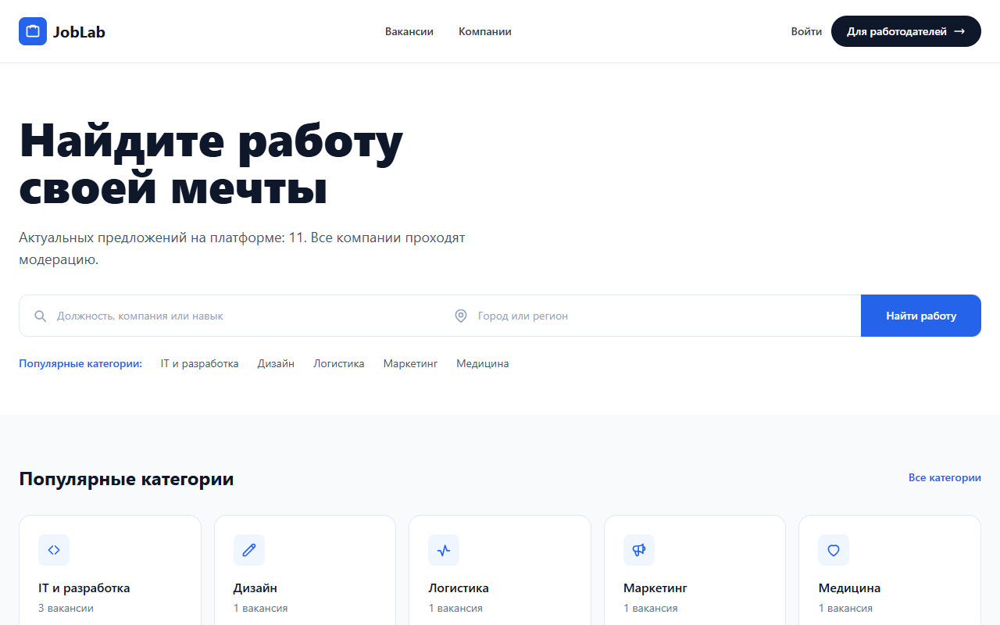
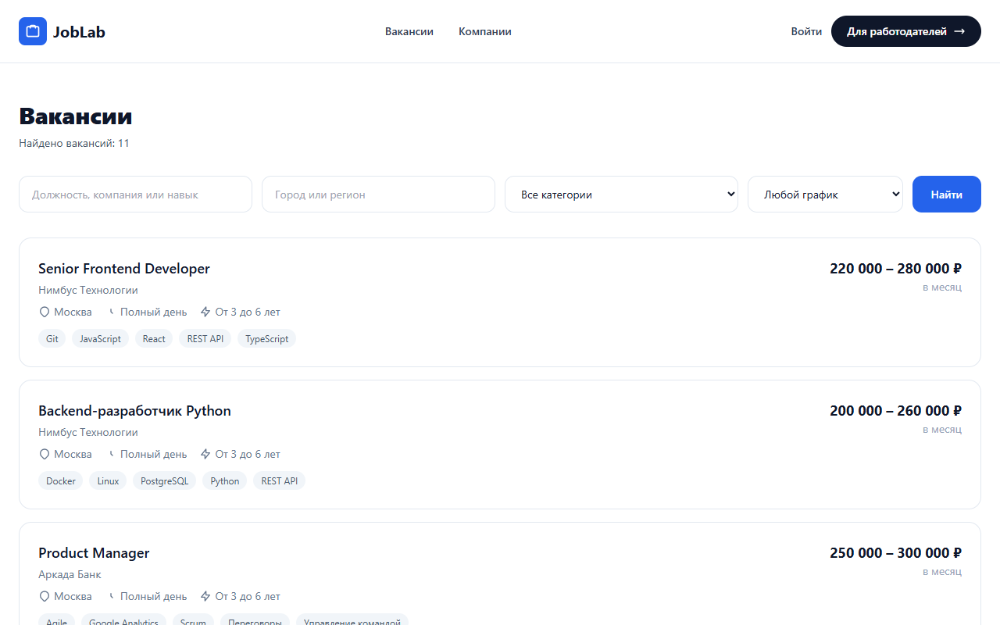
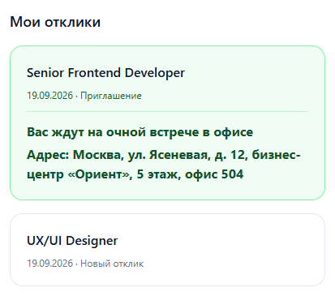
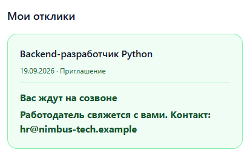
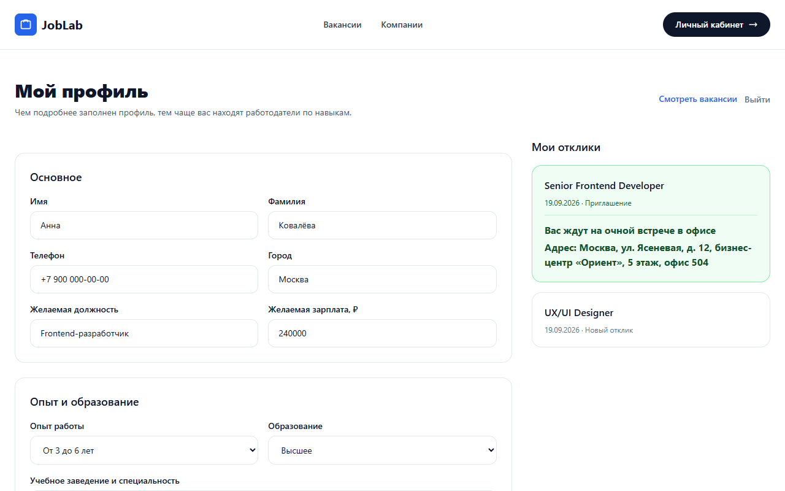
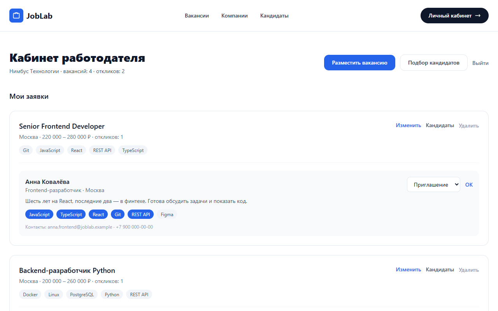
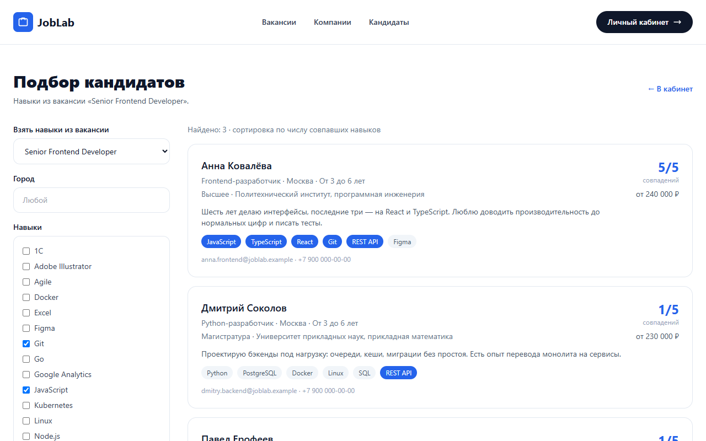
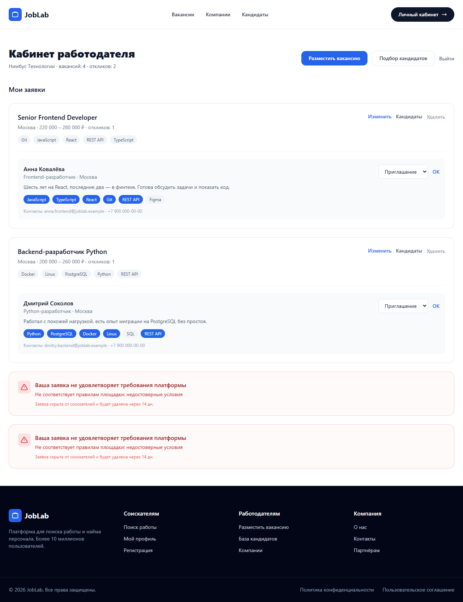

# JobLab

**Платформа поиска работы на WordPress без сторонних плагинов.**
Соискатели откликаются на вакансии, работодатели ведут отклики и подбирают кандидатов по навыкам, модератор управляет площадкой прямо из консоли WordPress.



> Портфолио-проект: тема, роли, модель данных, модерация и демо-данные написаны с нуля.
> Все компании, люди, адреса и почтовые домены в демо-данных вымышлены (домены — в зоне `.example`, зарезервированной RFC 2606).

**Стек:** PHP 8 · WordPress (собственная тема) · MySQL/MariaDB · Tailwind CSS · чистый JS

---

## Что умеет платформа

### Соискатель
- Регистрация и вход по e-mail.
- Профиль: контакты, желаемая должность и зарплата, опыт, образование, «о себе», навыки (готовые теги плюс свободный ввод).
- Переключатель «показывать мой профиль работодателям».
- Отклик на вакансию с сопроводительным сообщением (повторный отклик на ту же вакансию запрещён).
- Кабинет с историей откликов и их статусами.
- **Понятный следующий шаг после одобрения отклика** — см. ниже.

### Работодатель
- Регистрация вместе с карточкой компании, публичная страница компании со списком её вакансий.
- Публикация, редактирование и снятие вакансий: зарплатная вилка, тип занятости, требуемый опыт, категория, навыки.
- Входящие отклики под каждой вакансией со списком навыков кандидата, где совпавшие с вакансией подсвечены.
- Смена статуса отклика: новый → просмотрен → приглашение / отказ.
- **Подбор кандидатов** по навыкам вакансии с сортировкой по числу совпадений.

### Модератор (администратор WordPress)
- Блокировка вакансий и пользователей из обычных списков консоли: кнопка в строке, массовое действие, кнопка в карточке.
- Сводка по площадке и генератор демо-данных на странице **JobLab** в консоли.
- Правка полей вакансии, компании и отклика в метабоксах.

### Каталог для всех
- Поиск по должности, компании и навыку, фильтры по городу, категории и типу занятости.
- Страницы категорий, навыков и компаний.



---

## Фича: коммуникация после одобрения отклика

**Проблема.** Работодатель принимал отклик, а соискатель видел только смену статуса. Куда идти и как связаться, из интерфейса было не понять.

**Решение.** Работодатель в форме вакансии выбирает, где он ждёт кандидата: созвон или очная встреча. Адрес офиса он указывает в карточке компании. Когда отклик одобрен, карточка в кабинете соискателя становится зелёной, а жирным шрифтом написано, куда приходить:

| Очная встреча | Созвон |
|---|---|
|  |  |

Текст зависит от того, что заполнил работодатель:

| Поле вакансии | Что видит соискатель |
|---|---|
| Очная встреча | «Вас ждут на очной встрече в офисе» и адрес офиса компании |
| Созвон | «Вас ждут на созвоне» и контакт вакансии |
| Не указано | «Работодатель одобрил ваш отклик» и контакт для уточнения формата |

Последняя строка сделана намеренно. Если работодатель ничего не выбрал, система не должна обещать созвон или офис, которых никто не назначал.



---

## Кабинет работодателя и подбор кандидатов

Отклики группируются под вакансией. Статус меняется в один клик, контакты кандидата всегда под рукой.



Подбор кандидатов берёт навыки вакансии (или любой набор, выбранный вручную) и находит соискателей, чьи навыки пересекаются с ними. Заблокированные и скрывшие профиль не попадают в выдачу.



<details>
<summary>Форма размещения вакансии</summary>



</details>

---

## Как это устроено

Платформа построена на штатных сущностях WordPress, поэтому модерация работает в обычной консоли, а не в отдельной админке.

| Сущность | Как хранится |
|---|---|
| Вакансия | тип записи `jl_vacancy`, автор — работодатель |
| Компания | тип записи `jl_company`, одна на работодателя |
| Отклик | тип записи `jl_application`, автор — соискатель; в мете вакансия, работодатель, сообщение и статус |
| Категории | иерархическая таксономия `jl_category` |
| Навыки | таксономия `jl_skill`: висит и на вакансии, и на соискателе |
| Соискатель, работодатель | пользователи с ролями `jl_seeker` и `jl_employer`, профиль в usermeta |

### Инженерные решения

- **Свои роли и права.** Работодатель может править только собственные вакансии, соискатель и работодатель не попадают в `wp-admin` (их возвращают в кабинет), панель администратора для них скрыта. Модератор получает отдельное право `jl_moderate`. Администратор при этом всегда может войти через `wp-login.php?jl_wp=1`.
- **Блокировка как статус записи.** Вакансия получает защищённый статус `jl_banned`. Из публичных выборок она пропадает, по прямой ссылке отдаёт 404 всем, кроме автора и модератора, а автор видит причину. Заблокированный пользователь не может войти, а уже вошедшего перекидывает на страницу-заглушку.
- **Автоочистка.** Ежедневное задание cron удаляет заблокированное старше 14 дней вместе с откликами и компанией. Если cron не отработал, чистка догоняется при заходе модератора в консоль.
- **Формы через `admin-post.php`.** Все формы защищены nonce, а действия проверяют роль, блокировку и владение объектом (чужую вакансию или отклик изменить нельзя). Ввод санитизируется на записи, вывод экранируется в шаблонах. Отдельно учтено, что `admin-post.php` тоже вызывает `admin_init`, поэтому редирект пользователей из консоли его пропускает.
- **Подбор кандидатов одним SQL-запросом.** `JOIN` по usermeta считает число совпавших навыков (`COUNT(DISTINCT …)`), сортирует по нему и учитывает блокировку, видимость профиля и город. Запросы подготовлены через `$wpdb->prepare`.
- **Служебные страницы создаются сами.** Вход, регистрация, кабинет, форма вакансии, подбор кандидатов и заглушка блокировки появляются при активации темы, а их ID хранятся в опции. Тема сама включает ЧПУ и ставит cron.
- **Уведомления без сессий.** Сообщения после редиректа передаются через короткоживущий transient, поэтому не нужна ни PHP-сессия, ни куки.
- **Идемпотентный сидер демо-данных.** Повторный запуск не плодит дубликаты, а дозаполняет то, что появилось позже (так, например, к уже созданным вакансиям добавились форматы встречи). Всё демо помечено метой и откатывается одной кнопкой.

---

## Структура репозитория

```
index.html                       статичная вёрстка лендинга, из которой выросла тема
docs/screenshots/                скриншоты для README
wordpress/wp-content/themes/joblab/
├── functions.php                подключение модулей, Tailwind, меню
├── inc/
│   ├── setup.php                типы записей, таксономии, роли, статусы, установка страниц
│   ├── data.php                 профили, вакансии, отклики, подбор кандидатов, фильтры каталога
│   ├── auth.php                 регистрация, вход, перехват заблокированных
│   ├── forms.php                обработчики форм фронтенда
│   ├── moderation.php           блокировки в консоли, автоудаление
│   ├── admin.php                сводка модератора, метабоксы, демо-данные
│   ├── template-tags.php        карточки, плашки навыков, уведомления
│   └── seed.php                 генератор демонстрационных данных
├── templates/                   страницы: вход, регистрация, кабинет, форма вакансии, кандидаты
│   └── parts/                   кабинет соискателя и кабинет работодателя
└── *.php                        шаблоны главной, каталога, вакансии, компании, поиска, таксономий
```

В репозиторий попадает только тема и лендинг. Ядро WordPress, плагины, загрузки и `wp-config.php` закрыты `.gitignore`.
Подробное описание бэкенда: [wordpress/wp-content/themes/joblab/README.md](wordpress/wp-content/themes/joblab/README.md).

---

## Запуск локально

Нужны PHP 8, MySQL или MariaDB и веб-сервер (проект разрабатывался на [Open Server Panel](https://ospanel.io/) с Apache и PHP 8.4).

1. Установите чистый WordPress в `wordpress/` (или используйте существующую установку) и создайте базу данных.
2. Тема уже лежит по пути `wp-content/themes/joblab/`. Если у вас другая установка, скопируйте папку `joblab` в её `wp-content/themes/`.
3. В консоли откройте **Внешний вид → Темы** и активируйте **JobLab**. При активации создадутся роли, служебные страницы, ЧПУ и cron.
4. Откройте **JobLab → Тестовые данные** и нажмите «Создать тестовые данные». Появятся категории, навыки, компании, вакансии, соискатели и отклики.
5. Откройте сайт и войдите под любым демо-аккаунтом.

### Демо-аккаунты

Пароль у всех: `joblab123`.

| Роль | Логин | Что посмотреть |
|---|---|---|
| Работодатель | `hr@nimbus-tech.example` | кабинет, отклики, смена статуса, подбор кандидатов |
| Соискатель | `anna.frontend@joblab.example` | одобренный отклик с адресом офиса |
| Соискатель | `dmitry.backend@joblab.example` | одобренный отклик со звонком |
| Соискатель | `maxim.sales@joblab.example` | одобренный отклик без указанного формата |
| Соискатель | `banned.user@joblab.example` | заблокированный аккаунт |

Полный список аккаунтов лежит в [README темы](wordpress/wp-content/themes/joblab/README.md#тестовые-данные).

---

## Ограничения и что дальше

Это портфолио-проект, поэтому вот что в нём сознательно не сделано:

- **Tailwind подключён через CDN.** Для продакшена нужна сборка с purge, чтобы не тянуть рантайм-компилятор.
- **Нет автотестов.** Проверки делались вручную и одноразовыми скриптами против живой базы. Первыми стоит покрыть подбор кандидатов, права доступа и автоочистку.
- **Нет уведомлений.** Когда работодатель одобряет отклик, соискатель узнаёт об этом только в кабинете. Следующий шаг — письмо и/или внутреннее уведомление.
- **Нет переписки.** Формат встречи и контакт заданы на уровне вакансии. Логично двигаться к выбору конкретного времени встречи для каждого отклика.
- **Один офис у компании.** Адрес хранится на компании, а не на вакансии.

---

Автор: Kris Ratman · [github.com/KrisRatman](https://github.com/KrisRatman)
